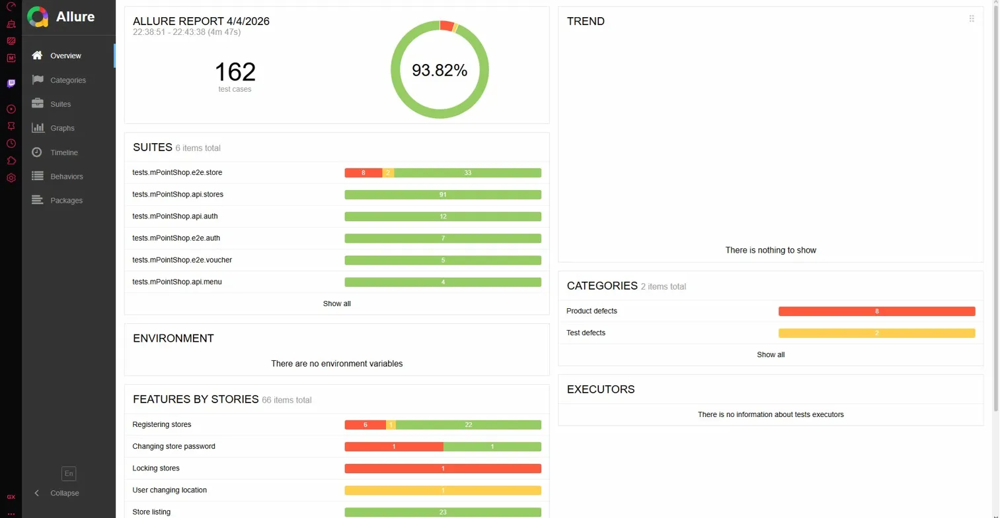
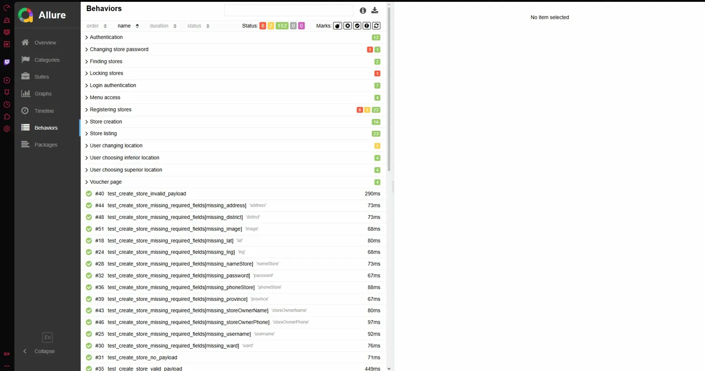
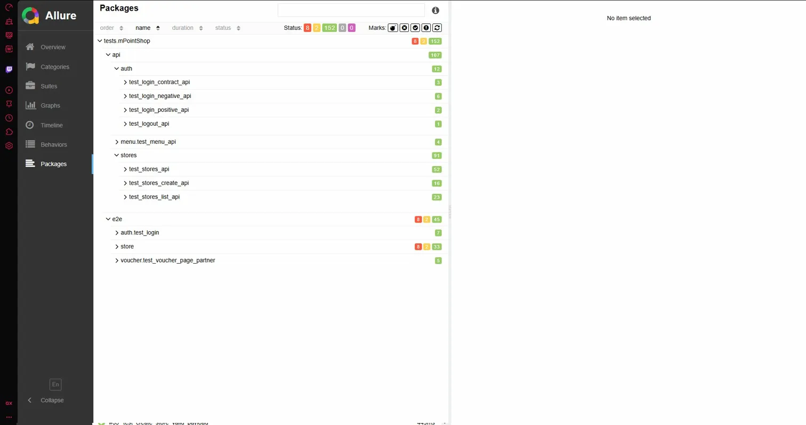

# mPointShop Rework 🚀


A Python QA automation framework for **mPointShop** and **mExchange** covering **UI**, **API**, and **hybrid** test flows with `pytest`, `selenium`, and `requests`, plus a prepared `mShop Admin` scaffold for future expansion.

---

## ✨ What This Project Covers

- **UI automation** using the **Page Object Model (POM)**
- **API testing** with reusable client and endpoint layers
- **Flow-based helpers** for chaining business actions across systems
- **Hybrid scenarios** where setup is done by API and validated through UI
- **Evidence-rich reporting** with HTML and Allure artifacts
- **Environment-based execution** via `.env` and `--env` options

---

## 🧰 Tech Stack

| Area | Tools |
|---|---|
| Language | `Python 3.12` |
| Test runner | `pytest` |
| UI | `selenium` |
| API | `requests` |
| Mobile (planned) | `Appium` for voucher retrieval coverage |
| Reporting | `allure-pytest`, `pytest-html` |
| Utilities | `Faker`, `pytest-xdist`, `pytest-repeat` |

---

## 📁 Repository Layout

```text
mPointShop_rework/
├─ mPointShop/
│  ├─ api/
│  │  ├─ endpoints/
│  │  ├─ helpers/
│  │  ├─ flows/
│  │  └─ api_assertions/
│  ├─ pages/
│  │  └─ components/
│  ├─ tests/
│  │  ├─ api/
│  │  └─ e2e/
│  └─ conftest.py
├─ mExchange/
│  ├─ api/
│  │  ├─ endpoints/
│  │  ├─ flows/
│  │  └─ helpers/
│  ├─ pages/
│  ├─ tests/
│  │  └─ api/
│  └─ conftest.py
├─ mShop Admin/
│  ├─ api/
│  ├─ pages/
│  └─ tests/
├─ core/
│  ├─ base/
│  ├─ drivers/
│  └─ utils/
├─ fixtures/
├─ data/
├─ config/
├─ reports/
├─ allure-results/
├─ allure-report/
├─ conftest.py
├─ pytest.ini
└─ requirements.txt
```

---

## 🧪 Test Coverage Snapshot

### `mPointShop`
- **API**: auth, menu, store, voucher-related coverage
- **E2E**: login, store flows, voucher flows, scan flows

### `mExchange`
- **API / integration flows** for synced voucher validation and commit scenarios

### Hybrid approach
Typical pattern used in this repo:
1. Create or prepare data through the API
2. Sync or pass data between systems
3. Verify the final result through API or UI

---

## ⚙️ Setup

### 1) Create a virtual environment

**Windows PowerShell**

```powershell
python -m venv .venv
.\.venv\Scripts\Activate.ps1
```

### 2) Install dependencies

```powershell
pip install -r requirements.txt
```

### 3) Configure `.env`

Copy `.env.example` to `.env` and provide real values.

Core variables used by the framework:

```env
DEV_WEB_BASE_URL=
DEV_API_BASE_URL=
DEV_PARTNER_USERNAME=
DEV_PARTNER_PASSWORD=
DEV_MERCHANT_USERNAME=
DEV_MERCHANT_PASSWORD=
DEV_DUP_USERNAME=

PROD_WEB_BASE_URL=
PROD_API_BASE_URL=
PROD_PARTNER_USERNAME=
PROD_PARTNER_PASSWORD=
PROD_MERCHANT_USERNAME=
PROD_MERCHANT_PASSWORD=
PROD_DUP_USERNAME=
```

If you run `mExchange` coverage, also add the values referenced by `config/env_config.py`:

```env
DEV_MEXCHANGE_WEB_URL=
DEV_MEXCHANGE_API_URL=
DEV_MEXCHANGE_USERNAME=
DEV_MEXCHANGE_PASSWORD=

PROD_MEXCHANGE_WEB_URL=
PROD_MEXCHANGE_API_URL=
PROD_MEXCHANGE_USERNAME=
PROD_MEXCHANGE_PASSWORD=
```

---

## ▶️ Running Tests

### Run the full suite

```powershell
pytest
```

### Run by area

```powershell
pytest mPointShop/tests/api
pytest mPointShop/tests/e2e
pytest mExchange/tests/api
```

### Run by feature folder

```powershell
pytest mPointShop/tests/e2e/auth
pytest mPointShop/tests/e2e/store
pytest mPointShop/tests/e2e/voucher
pytest mExchange/tests/api/voucher
```

### Run with markers

```powershell
pytest -m api
pytest -m e2e
pytest -m smoke
pytest -m regression
pytest -m ongoing
```

### Run with custom options

```powershell
pytest --env=dev --browser=chrome
```

Available CLI options from `conftest.py`:
- `--env` → selects the target environment, e.g. `dev` or `prod`
- `--browser` → browser for UI execution, default: `chrome`

---

## 📊 Reports

### HTML report
After every run, the report is generated at:

```text
reports/report.html
```

### Allure report

```powershell
pytest --alluredir=allure-results
allure serve allure-results
```

On failures, the framework captures useful artifacts such as:
- screenshots
- page source
- current URL
- browser logs (when available)

---

## 🧠 Framework Conventions

- Keep test files focused on **assertions and intent**
- Keep **shared infrastructure** in `core/` (`base`, `drivers`, `utils`)
- Keep **system-specific logic** inside `mPointShop/`, `mExchange/`, and future systems like `mShop Admin/`
- Prefer **fixtures and test data modules** over duplicated setup code
- Separate coverage by **system** and **test type** for easier maintenance

---

## 📸 Test Report Snapshot

Examples from my Allure report:

### Overview
<p align="center">
  
</p>

### Behaviors
<p align="center">
  
</p>

### Packages
<p align="center">
  
</p>

These screenshots are stored in `assets/readme/`.


---

## 🗺️ Next Plan

### 1) Continue building the third system
- Expand the prepared **`mShop Admin/`** structure using the same `api/`, `pages/`, and `tests/` layers
- Add cross-system voucher validation so the same voucher can be tracked across all integrated platforms
- Reuse the existing `client -> endpoints -> flows -> tests` structure for consistency

### 2) Add Appium for voucher retrieval testing
- Introduce **Appium** for mobile coverage focused on the **getting voucher** flow
- Automate the steps: login → open voucher screen → get/claim voucher → verify success state
- Cross-check the result in API / admin systems after the mobile action
- Attach mobile screenshots and evidence into Allure for the full end-to-end story
